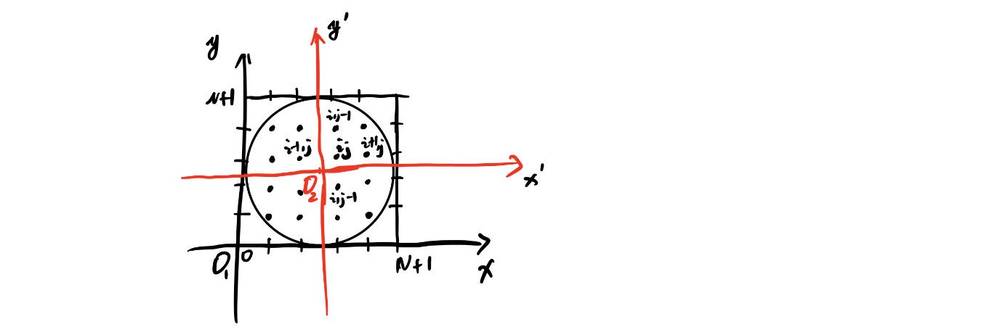
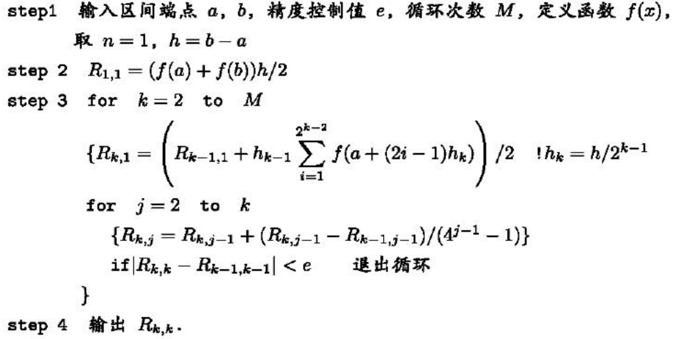
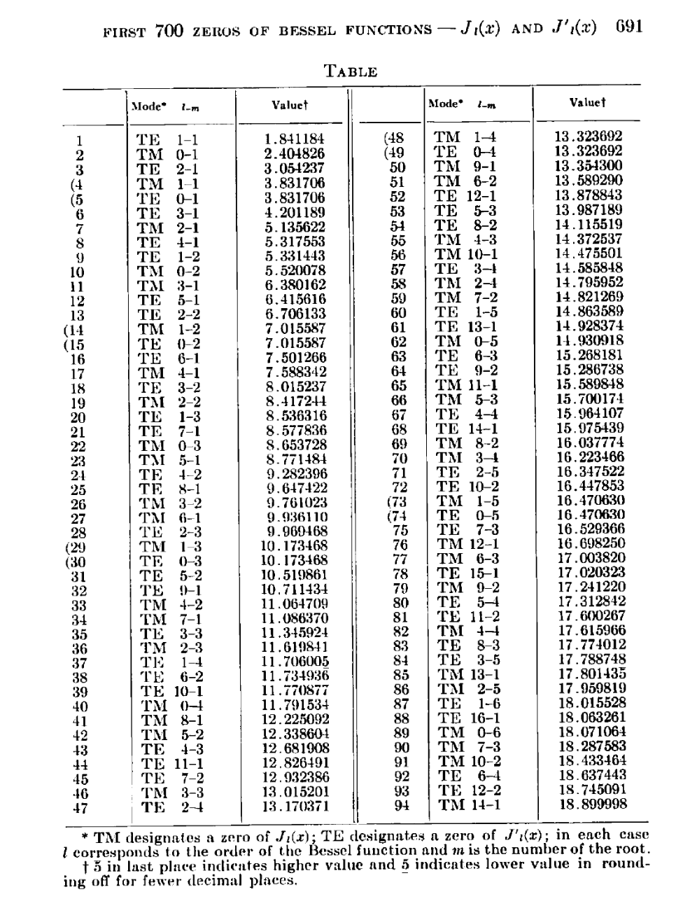

# 兰州大学数学物理方法2小课题
[Github web address](https://github.com/jdw-heaven/Mathematical_Physics)

## 通用理论

### 1. (非)均匀齐次Helmholtz方程的有限差分法(Finite Difference Method)(1st B.C.)

#### a. 1-dimension

$\qquad$ 对于非均匀的Helmholtz方程：
$$-f(x)\Delta u(x) = k^2 u(x) $$

$\qquad$我们可以采用差分的形式来表示，如上图1:
$$
\begin{aligned}
\frac{\partial u}{\partial x}\vert_{i} &= \frac{u\vert_{i+\frac{1}{2}}-u\vert_{i-\frac{1}{2}}}{\delta x} \\
so, \frac{\partial^{2} u}{\partial x^{2}}\vert_{i} &= \frac{\frac{u\vert_{i+1}-u\vert_{i}}{\delta x}-\frac{u\vert_{i}-u\vert_{i-1}}{\delta x}}{\delta x} \\
&=\frac{u\vert_{i+1}+u\vert_{i-1}-2*u\vert_{i}}{(\delta x)^{2}} \\ 
\end{aligned}
$$

$\qquad$ 因此非均匀Helmholtz方程可以写为：
$$
\begin{aligned}
-f\vert_{i}*\frac{u\vert_{i+1}+u\vert_{i-1}-2*u\vert_{i}}{(\delta x)^{2}} = k^{2}*u\vert_{i}
\end{aligned}
$$

$\qquad$ 考虑边界条件我们可以得到：
$$
\begin{aligned}
& u\vert_{0} = u\vert_{N+1} = 0 \\
so\quad& \frac{\partial^{2} u}{\partial x^{2}}\vert_{1} = \frac{u\vert_{2}-2*u\vert_{1}}{(\delta x)^{2}} \\
and\quad& \frac{\partial^{2} u}{\partial x^{2}}\vert_{N} = \frac{u\vert_{N-1}-2*u\vert_{N}}{(\delta x)^{2}} \\
\end{aligned}
$$

$\qquad$ 综上，我们可以得到N个线性无关的线性方程组，写成矩阵形式即为：
$$
\frac{1}{\delta x^{2}}\begin{bmatrix}2f_{1} & -f_{1} & & & \\ -f_{2} & 2f_{2} & -f_{2} & & \\ & & \ddots & & \\ & & -f_{N-1} & 2f_{N-1} & -f_{N-1} \\ & & & -f_{N} & 2f_{N} \\ \end{bmatrix}\begin{bmatrix} u_{1} \\ u_{2} \\ \vdots \\ u_{N-1} \\ u_{N} \end{bmatrix} = k^{2}*\begin{bmatrix} u_{1} \\ u_{2} \\ \vdots \\ u_{N-1} \\ u_{N} \end{bmatrix}
$$

$\qquad$ 通过这个方程的本征解我们可以得到非线性(线性)Helmholtz方程本征解的近似解。这种方法我们称为有限差分法。

#### b. 2-dimension

$\qquad$ 对于二维的非线性(线性)Helmholtz方程：
$$-f(x,y)\Delta u(x,y) = k^2 u(x,y) $$

$\qquad$ 重复上面的操作，我们可以得到：
$$
\begin{aligned}
-f\vert_{ij}*(\frac{u\vert_{i+1,j}+u\vert_{i-1,j}-2*u\vert_{i,j}}{(\delta x)^{2}}+\frac{u\vert_{i,j+1}+u\vert_{i,j-1}-2*u\vert_{i,j}}{(\delta y)^{2}}) = k^{2}*u\vert_{ij}
\end{aligned}
$$

$\qquad$ 我们同样可以写成矩阵方程的形式，只不过会比较大，这里只给出向量参数的形式：
$$\left(u_{11}\quad u_{12}\quad \dots\quad u_{1N}\quad u_{21}\quad \dots\quad u_{2N}\quad \dots\quad u_{N1}\quad \dots\quad u_{NN} \right)^{\top} $$

$\qquad$ 以上就是有限差分法的基本原理，处理具体问题的时候还需要一定的计算技巧。

### 2. 一维有限区域齐次Helmholtz方程的解(1st B.C.)

$$
\begin{align*}
&\Delta u(x) + k^{2}u(x) = 0,x \in [a,b] \\
&u(a) = u(b) = 0 \\
\end{align*}
$$

$\qquad$ 这是一个可解问题，PDE理论有完美的解释。其对应的本征多项式为$\lambda^{2}+k^{2} = 0 \rightarrow \lambda = \pm ik $。通解可以表示为：
$$u = C_{1}e^{ik(x-a)}+C_{2}e^{-ik(x-a)} $$
$\qquad$ 如果我们只考虑实数域上的，上面的通解可以转换为：
$$u = C_{1}\cos k(x-a) + C_{2}\sin k(x-a) $$
$\qquad$ 将边界条件代入我们可以得到：
$$
\begin{align*}
&u(a) = C_{1} = 0 \\
&u(b) = C_{1}\cos k(b-a) + C_{2}\sin k(b-a) = 0 \\
\end{align*}
$$
$\qquad$ 即
$$u = C\sin \frac{n\pi}{b-a}(x-a),\quad n = 0, \pm 1, \pm 2, \dots $$

### 3. 二维圆形区域齐次Helmholtz方程的解(1st B.C.)

$$
\begin{align*}
& (\Delta + k^{2})u(\rho , \varphi) = 0,\quad \rho < b;\varphi \in [0,2\pi) \\
& u(b,\varphi) = 0 \\
\end{align*}
$$

$\qquad$ 将上面的式子展开并考虑物理的情况：
$$
\begin{align*}
& \frac{1}{\rho}\frac{\partial }{\partial \rho}(\rho \frac{\partial u}{\partial \rho}) + \frac{1}{\rho ^{2}}\frac{\partial ^{2} u}{\partial \varphi ^{2}} + k^{2}u = 0 \\
& u(b,\varphi ) = 0, u(\rho , \varphi )\vert _{\rho = 0} 有限 \\
& u(\rho , \varphi) = u(\rho , \varphi+2\pi)
\end{align*}
$$

$\qquad$ 令$u(\rho , \varphi) = R(\rho )\Phi (\varphi) $，轴向方程为：

$$
\begin{align*}
& \frac{d^{2} \Phi(\varphi )}{d\varphi ^{2}} + m^{2}\Phi (\varphi) = 0; \\
& \Phi (\varphi ) = \Phi (\varphi + 2\pi ) \\
\end{align*}
$$

$\qquad$ 在实数域中，其通解可以表示为：
$$\varphi (m) = \cos m\varphi , \sin m\varphi \quad m = 0, \pm 1, \pm 2, \dots $$

$\qquad$ 径向方程可以表示为：
$$
\begin{align*}
& \frac{1}{\rho }\frac{d }{d\rho }(\rho \frac{d R(\rho )}{d\rho }) + (k^{2} - \frac{m^{2}}{\rho ^{2}})R(\rho ) = 0\rightarrow Bessel Equation \\
& R(b) = 0, R(0)有限 \\
\end{align*}
$$

$\qquad$ Bessel方程的解为：
$$R^{(m)}(\rho ) = C_{m}J_{m}(k\rho ) + D_{m}N_{m}(k\rho) $$

$\qquad$ 将边界条件和物理条件代入可得：
$$
\begin{align*}
& R(0)有限\rightarrow D_{m} = 0 \\
& R(b) = 0\rightarrow J_{m}(k\rho ) = 0 \\
\end{align*}
$$

$\qquad$ 因此，这个问题的本征值和本征解为：
$$
\begin{align*}
& [k_{n}^{(m)}]^{2} = [\frac{x_{n}^{(m)}}{b}]^{2},\quad n = 1,2,3,\dots \\
& R_{n}^{(m)}(\rho ) = J_{m}(\frac{x_{n}^{(m)}}{b}*\rho ),\quad n = 1,2,3,\dots \\
\end{align*}
$$

### 4. (非)均匀齐次Helmholtz方程的谱方法(Spectral Method)(1st B.C.)

#### a. 1-dimension

$$
\begin{align*}
& (f(x)\Delta + k^{2})u(x) = 0 \\
\rightarrow & -f(x)\Delta(x) = k^{2}u(x) \\
\end{align*}
$$

$\qquad$ 设$(\Delta + k^{2})u(x) = 0 $的本征解为$\{\varphi _{n}, n = 1,2,\dots \}$，对应的的本征值为$\widetilde{k_{n}} $。令$u(x) = \sum_{n} c_{n}\varphi (x) $。
$$
\begin{align*}
左侧:\quad & -f(x)\Delta u(x) = -f(x)\sum_{n} c_{n}\widetilde{k_{n}^{2}}\varphi _{n}(x) \\
右侧:\quad & k^{2}\sum _{n}c_{n}\varphi _{n}(x)
\end{align*}
$$

$\qquad$ 分别与$\varphi _{m} $做内积：
$$
\begin{align*}
左侧：\quad &\left\langle \varphi _{m}, -f(x)\sum_{n} c_{n}\widetilde{k_{n}^{2}}\varphi _{n}(x) \right\rangle \\
 =& -\sum_{n}c_{n}\widetilde{k_{n}^{2}}\left\langle \varphi _{m}, f(x)\varphi _{n}(x) \right\rangle \\
 = &-\sum _{n}M_{mn}\widetilde{k_{n}^{2}}c_{n}\quad 令\left\langle \varphi _{m}, f(x)\varphi _{n}(x) \right\rangle = M_{mn} \\
右侧：\quad & \left\langle \varphi _{m}, k^{2}\sum _{n}c_{n}\varphi _{n}(x) \right\rangle \\
= & k^{2}\sum _{n}c_{n}\left\langle \varphi _{m}, \varphi _{n}(x) \right\rangle \\
= & k^{2}\sum _{n}c_{n}\delta _{mn} \left\langle \varphi _{m}, \varphi _{m} \right\rangle \\
= & k^{2}N_{m}c_{m}\quad 令\left\langle \varphi _{m}, \varphi _{m} \right\rangle = N_{m} \\
\end{align*}
$$

$\qquad$ 由上面的推到我们可以得到：
$$
\begin{align*}
& -\sum _{n}M_{mn}\widetilde{k_{n}^{2}}c_{n} = k^{2}N_{m}c_{m} \\
\Rightarrow & -\sum _{n}\frac{M_{mn}\widetilde{k_{n}^{2}}}{N_{m}}c_{n} = k^{2}c_{m} \\
\Rightarrow & \sum _{n}\widetilde{M}_{mn}c_{n} = k^{2}c_{m} \\
\end{align*}
$$

$\qquad$ 这又是一个矩阵方程，我们可以通过对角化的方式求出对应的特征值和特征向量：
$$
\begin{align*}
& (\widetilde{M}_{mn}) = \widetilde{M},(c_{1},c_{2},\dots,c_{n})^{\top} = C \\
& \widetilde{M}C = k^{2}C \\
\Rightarrow & \widetilde{M}C_{\alpha } = \lambda _{\alpha }C_{\alpha},\alpha  = 1,2,\dots \\
\end{align*},
$$

$\qquad$ 综上，非线性(线性)齐次Helmholtz方程的解为：
$$
\begin{align*}
& k^{2}_{\alpha } = \lambda _{\alpha },k_{\alpha } = \sqrt{\lambda _{\alpha }},C_{\alpha } = (c_{\alpha _{1}}, c_{\alpha _{2}}, \dots, c_{\alpha _{n}})^{\top } \\
& u_{\alpha }(x) = \sum _{n}c_{\alpha n}\varphi _{n}(\lambda ) \\
\end{align*}
$$

## 补充内容

### 1. Romeberg积分方法

$\qquad$ 在谱方法中我们需要用到数值积分公式，由于我们使用的是C语言，没有现成的函数供我们使用，因此决定自己编写目前最具效率的积分方法——Romberg积分。这里只给出伪代码；推导过程可以在任何一本数值积分教材中找到(下面的伪代码来自《数值计算方法与算法》)，具体的程序会有一些技巧，以具体程序为准。**例如，在判断是否退出循环前至少需要迭代几次，大部分情况都是没问题的，但也有少部分特殊情况；不要问我怎么知道的😭😭😭😭😭😭**

### 2. packages

#### a. LAPACK

$\qquad$程序会涉及到矩阵的对角化，我们使用矩阵运算库LAPACK。访问官网请点击[here](https://netlib.org/lapack/)。

#### b. GNU Scientific Library

$\qquad$ 这个库应该比较强大，除了涉及一些特殊函数外还有很多其他的东西，但我暂时没有时间爱你深究，引入它是因为我们需要用到柱函数的解；也就是Bessel函数，其他功能以Bessel函数的使用方法可以参考官网上的[Docs](https://www.gnu.org/manual/manual.html)。

### 3.Bessel 函数及其导数的零点

$\qquad$ 在第一类边界条件、二维圆区域问题中，Helmholtz方程的本征值实际上就是Bessel函数的零点，下面我们给出Bessel函数零点的参考值,引自[^1]。

[^1]: Beattie, C. L. (1957). Table of first 700 zeros of Bessel functions -Jl(x) and J'l(X).