# 小课题 1

$$
\begin{align*}
& \frac{T}{\rho } \Delta u + \mu ^{2}u = 0 \\
& T = T_{0} = 1, \rho  = \rho _{0} + \rho _{1}, \rho _{0} = 1, u\vert _{\partial D} = 0 \\
\end{align*}
$$

$\qquad$ 在一维情况下，分别用有限差分法和谱方法讨论$\rho _{1} = 0\quad and\quad \rho _{1} = 0.3\sin \frac{\pi (x-a)}{b-a} $情况下的本征值和本征向量并进行比较。

$\qquad$ 为了方便起见，我们令a = 0, b = 1，即length = 1。

### 结果与讨论

#### a. 有限差分法($\rho _{1} = 0$)

$\qquad$ 为了增加数值稳定性，我们将$\delta x^{2} $分别作用在矩阵元和特征值上面：
```C
    A[0] = 2*m_f(dx)/dx;
    A[1] = -1*m_f(dx)/dx;
    A[N*N-1] = 2*m_f(N*dx)/dx;
    A[N*N-2] = -1*m_f(N*dx)/dx;
    for(int i=1; i<N-1; i++){
        A[i*N+i] = 2*m_f((i+1)*dx)/dx;
        A[i*N+i-1] = -A[i*N+i]/2;
        A[i*N+i+1] = -A[i*N+i]/2;
    }

    ......

    fprintf(eigenvalue, "%lf\n", sqrt(lambda[i]/(dx)));
```

$\qquad$ 也就是说：
$$
\frac{1}{\delta x}\begin{bmatrix}2f_{1} & -f_{1} & & & \\ -f_{2} & 2f_{2} & -f_{2} & & \\ & & \ddots & & \\ & & -f_{N-1} & 2f_{N-1} & -f_{N-1} \\ & & & -f_{N} & 2f_{N} \\ \end{bmatrix}\begin{bmatrix} u_{1} \\ u_{2} \\ \vdots \\ u_{N-1} \\ u_{N} \end{bmatrix} = \delta x*k^{2}*\begin{bmatrix} u_{1} \\ u_{2} \\ \vdots \\ u_{N-1} \\ u_{N} \end{bmatrix}
$$

| eigenvalue\N | 9 | 29 | 59 | 99 | 299 | 599 | 999 | 1999 |
|---|---|---|---|---|---|---|---|---|
| 1 | 3.128689 | 3.140157 | 3.141234 | 3.141463 | 3.141578 | 3.141589 | 3.141591 | 3.141592 |
| 2 | 6.180340 | 6.271708 | 6.280315 | 6.282152 | 6.283070 | 6.283157 | 6.283175 | 6.283183 |
| 3 | 9.079810 | 9.386068 | 9.415091 | 9.421290 | 9.424390 | 9.424681 | 9.424743 | 9.424769 |
| 4 | 11.755705 | 12.474701 | 12.543416 | 12.558104 | 12.565452 | 12.566141 | 12.566288 | 12.566350 |
| 5 | 14.142136 | 15.529143 | 15.663143 | 15.691819 | 15.706169 | 15.707515 | 15.707802 | 15.707923 |
| 6 | 16.180340 | 18.541020 | 18.772136 | 18.821663 | 18.846455 | 18.848781 | 18.849277 | 18.849486 |
| 7 | 17.820130 | 21.502077 | 21.868263 | 21.946862 | 21.986225 | 21.989918 | 21.990705 | 21.991038 |
| 8 | 19.021130 | 24.404199 | 24.949403 | 25.066647 | 25.125392 | 25.130904 | 25.132080 | 25.132576 |

$\qquad$ 通过改变格点N的大小，可以给出该方法的收敛速度，如上表；对于基态其收敛速度还是比较慢的，后面的态就更不用说了。如果用直接对角化的方式，计算机的极限应该也就是一万左右，应该可以精确到小数点后7、8位这样。

$\qquad$ 下面给几个图，空间有限剩下的可以在该目录下/pic看到。

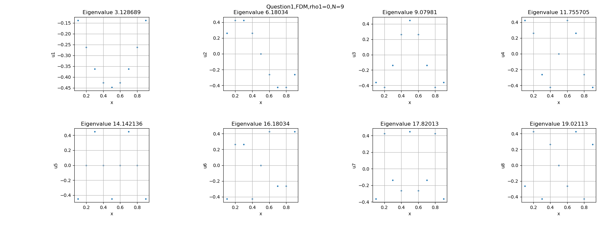
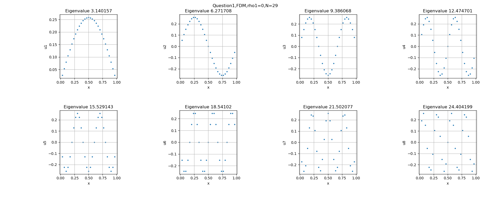
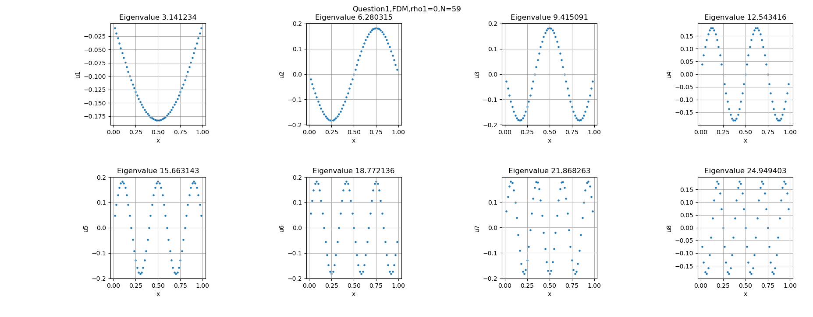
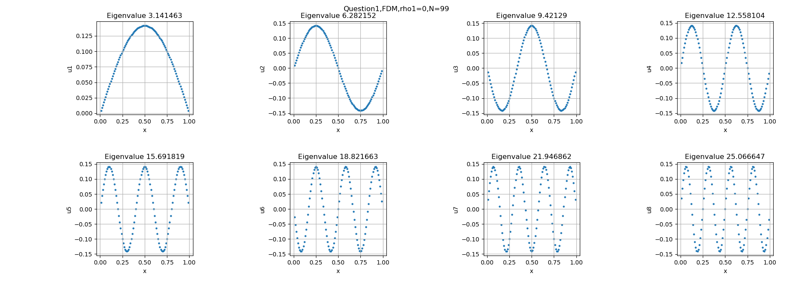

#### b. 有限差分法($\rho _{1} = 0.3\sin \pi x $)

$\qquad$ 由于非线性Laplace方程的有限元矩阵形式不是对角的，因此我们不能使用LAPACKE_dsyev进行对角化，只能用LAPACKE_dgeev来对角化，特征值也是混乱排序的，因此需要我们来排序。

$\qquad$ 为了得到一些规律，我们还算了$\rho _{1} = \pm 0.3*\cos (\pi x), -0.3*\sin (\pi x) $的情况，和我们能从理论上得到的一样，对于cos函数，由于其在区间上不具有轴对称性，因此其对特征向量的影响是轴对称的，对特征值的影响相同；与此相反，sin函数对特征值的影响是轴对称的，同时对特征向量的影响也不太相同。

$\qquad$ 下面给出cos函数作为非线性项的特征值和特征向量。由于正负不影响特征值，因此我们只给出一组。

| eigenvalue\N | 9 | 29 | 59 | 99 | 299 | 599 | 999 | 1999 |
|---|---|---|---|---|---|---|---|---|
| 1 | 3.116741 | 3.128509 | 3.129613 | 3.129849 | 3.129967 | 3.129978 | 3.129980 | 3.129981 |
| 2 | 6.212084 | 6.307349 | 6.316305 | 6.318216 | 6.319171 | 6.319261 | 6.319280 | 6.319288 |
| 3 | 9.120041 | 9.440439 | 9.470657 | 9.477108 | 9.480334 | 9.480637 | 9.480701 | 9.480728 |
| 4 | 11.788711 | 12.544789 | 12.616368 | 12.631656 | 12.639303 | 12.640020 | 12.640173 | 12.640238 |
| 5 | 14.142136 | 15.613447 | 15.753119 | 15.782973 | 15.797908 | 15.799308 | 15.799607 | 15.799733 |
| 6 | 16.094036 | 18.637678 | 18.878761 | 18.930333 | 18.956138 | 18.958557 | 18.959074 | 18.959292 |
| 7 | 17.618985 | 21.608708 | 21.991042 | 22.072905 | 22.113878 | 22.117721 | 22.118540 | 22.118886 |
| 8 | 19.253639 | 24.517839 | 25.087722 | 25.209868 | 25.271021 | 25.276757 | 25.277981 | 25.278497 |

$\qquad \rho _{1} = 0.3*\cos (\pi x) $ ：

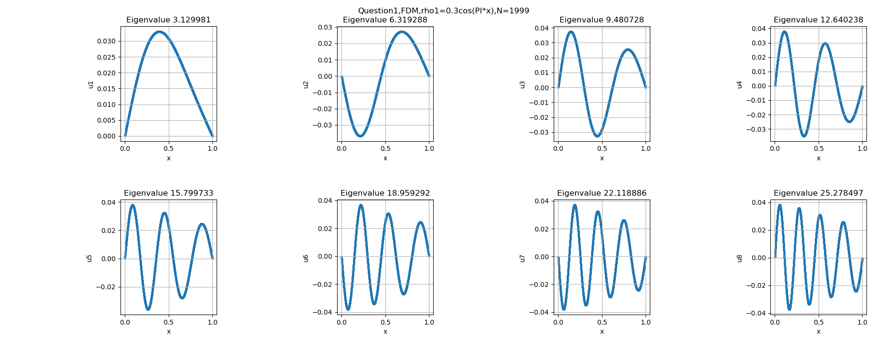

$\qquad \rho _{1} = -0.3*\cos (\pi x) $ ：

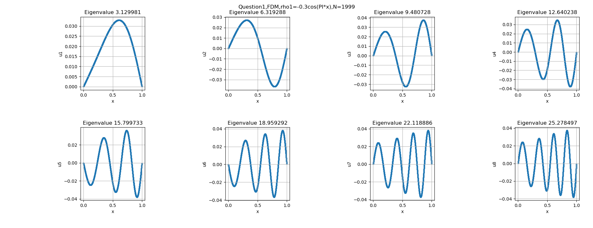

$\qquad$ 下面给出sin函数作为非线性项的特征值和特征向量。

$\qquad \rho _{1} = 0.3*\sin (\pi x) $ ：

| eigenvalue\N | 9 | 29 | 59 | 99 | 299 | 599 | 999 | 1999 |
|---|---|---|---|---|---|---|---|---|
| 1 | 2.792852 | 2.803143 | 2.804106 | 2.804312 | 2.804414 | 2.804424 | 2.804426 | 2.804427 |
| 2 | 5.630320 | 5.714135 | 5.722005 | 5.723684 | 5.724524 | 5.724603 | 5.724619 | 5.724627 |
| 3 | 8.300479 | 8.582815 | 8.609472 | 8.615163 | 8.618010 | 8.618276 | 8.618333 | 8.618357 |
| 4 | 10.756756 | 11.421203 | 11.484415 | 11.497922 | 11.504678 | 11.505312 | 11.505447 | 11.505504 |
| 5 | 12.941011 | 14.225515 | 14.348884 | 14.375272 | 14.388476 | 14.389714 | 14.389978 | 14.390089 |
| 6 | 14.797137 | 16.989327 | 17.202209 | 17.247804 | 17.270625 | 17.272766 | 17.273222 | 17.273415 |
| 7 | 16.264939 | 19.705556 | 20.042974 | 20.115352 | 20.151593 | 20.154993 | 20.155718 | 20.156024 |
| 8 | 17.413524 | 22.366964 | 22.869489 | 22.977473 | 23.031568 | 23.036643 | 23.037726 | 23.038183 |

$\qquad \rho _{1} = -0.3*\sin (\pi x) $ ：

| eigenvalue\N | 9 | 29 | 59 | 99 | 299 | 599 | 999 | 1999 |
|---|---|---|---|---|---|---|---|---|
| 1 | 3.622867 | 3.636142 | 3.637394 | 3.637661 | 3.637795 | 3.637808 | 3.637810 | 3.637811 |
| 2 | 6.919410 | 7.021892 | 7.031594 | 7.033666 | 7.034702 | 7.034799 | 7.034820 | 7.034828 |
| 3 | 10.136179 | 10.479211 | 10.511878 | 10.518858 | 10.522349 | 10.522676 | 10.522746 | 10.522775 |
| 4 | 13.105994 | 13.910814 | 13.988109 | 14.004637 | 14.012906 | 14.013681 | 14.013846 | 14.013916 |
| 5 | 15.755801 | 17.307041 | 17.457751 | 17.490009 | 17.506152 | 17.507665 | 17.507988 | 17.508125 |
| 6 | 18.025863 | 20.656758 | 20.916702 | 20.972409 | 21.000295 | 21.002910 | 21.003468 | 21.003704 |
| 7 | 19.905438 | 23.950053 | 24.361976 | 24.450379 | 24.494649 | 24.498802 | 24.499688 | 24.500062 |
| 8 | 21.508557 | 27.177432 | 27.790883 | 27.922752 | 27.988818 | 27.995017 | 27.996339 | 27.996897 |

$\qquad \rho _{1} = 0.3*\sin (\pi x) $ ：

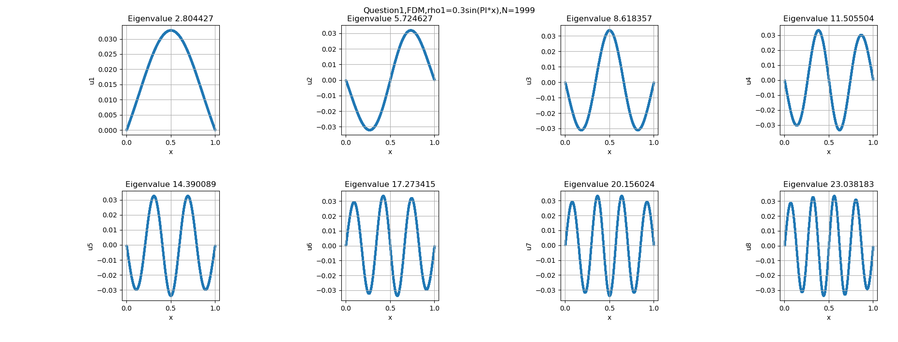

$\qquad \rho _{1} = -0.3*\sin (\pi x) $ ：

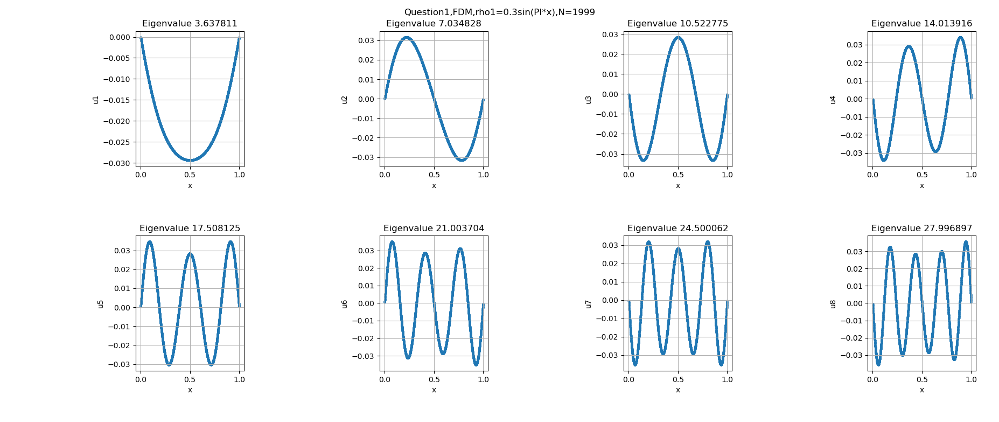


#### c. 谱方法($\rho _{1} = 0$)

$\qquad$ 对于谱方法，一维固定边界条件下Laplace方程的解是正弦函数，我们可以直接给出积分的通式：

$$
\begin{align*}
M_{mn} &= \left\langle \varphi _{m}, f(x)\varphi _{n}(x) \right\rangle \\
 &= \int_{0}^{1} \sin (m\pi x)*1*sin(n\pi x) \,dx \\
 &= -\frac{1}{2} (\delta _{m,n} - \delta _{m,-n}) \\
N_{m} &= \left\langle \varphi _{m}, \varphi _{m} \right\rangle \\
&= \int_{0}^{1} \sin (m\pi x)*sin(m\pi x) \,dx \\
&= \frac{1}{2}
\end{align*}
$$

$\qquad$ 我们将使用上面的表达式、Romberg积分分别计算；并以此为依据来判断Romberg积分方法的数值稳定性。**注意，从上面的式子我们还可以观察出来——$\rho _{1} = 0$时谱方法的矩阵形式一定是对角的，这样我们就可以方便地使用LAPACKE_dsyev函数来进行对角化了**。另外由于romberg积分的不稳定性以及时间复杂度，我们会减少点的个数。

| eigenvalue\N | 9 | 29 | 59 | 99 | 299 |
|---|---|---|---|---|---|
| 1 | 3.141593 | 3.141593 | 3.141593 | 3.141593 | 3.141593 |
| 2 | 6.283185 | 6.283185 | 6.283185 | 6.283185 | 6.283185 |
| 3 | 9.424778 | 9.424778 | 9.424778 | 9.424778 | 9.424778 |
| 4 | 12.566371 | 12.566371 | 12.566371 | 12.566371 | 12.566371 |
| 5 | 15.707963 | 15.707963 | 15.707963 | 15.707963 | 15.707963 |
| 6 | 18.849556 | 18.849556 | 18.849556 | 18.849556 | 18.849556 |
| 7 | 21.991149 | 21.991149 | 21.991149 | 21.991149 | 21.991149 |
| 8 | 25.132741 | 25.132741 | 25.132741 | 25.132741 | 25.132741 |

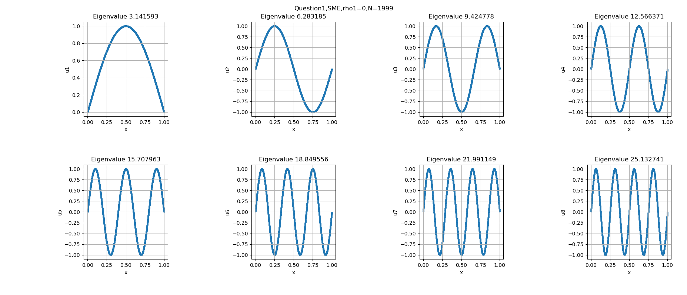

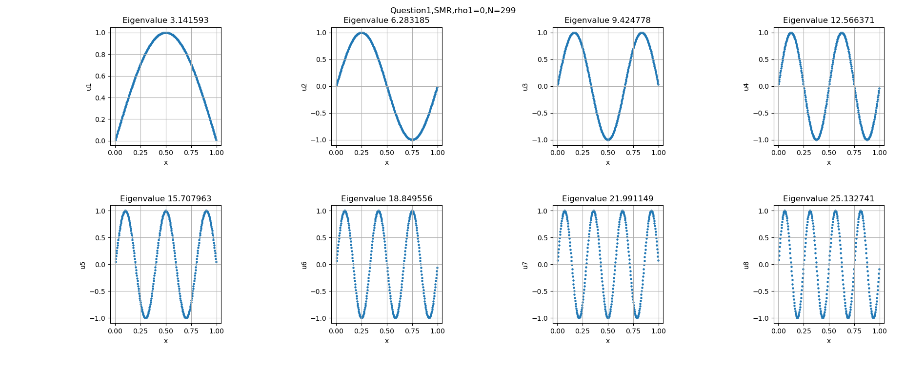

#### d. 谱方法($\rho _{1} = 0.3\sin \pi x$)

$$
\begin{align*}
M_{mn} &= \left\langle \varphi _{m}, f(x)\varphi _{n}(x) \right\rangle \\
 &= \int_{0}^{1} \sin (m\pi x)*0.3*\sin \pi x*sin(n\pi x) \,dx \\
 &这个结果需要分类讨论，写起程序来比较费劲，我们就直接使用romberg积分算了\\
N_{m} &= \left\langle \varphi _{m}, \varphi _{m} \right\rangle \\
&= \int_{0}^{1} \sin (m\pi x)*sin(m\pi x) \,dx \\
&= \frac{1}{2}
\end{align*}
$$

$\qquad$ **需要注意的是上面的结果说明矩阵不是对称的，不能是使用LAPACKE_dsyev来对角化。** 另外由于romberg积分的不稳定性以及时间复杂度，我们会减少点的个数。

| eigenvalue\N | 9 | 29 | 59 | 99 | 299 |
|---|---|---|---|---|---|
| 1 | 3.011534 | 3.003449 | 3.002611 | 3.002427 | 3.002333 |
| 2 | 5.753933 | 5.666533 | 5.658036 | 5.656199 | 5.655273 |
| 3 | 8.380866 | 8.129817 | 8.099802 | 8.092860 | 8.089231 |
| 4 | 11.317230 | 10.599504 | 10.517187 | 10.498008 | 10.487922 |
| 5 | 14.210133 | 13.087753 | 12.932862 | 12.893849 | 12.872325 |
| 6 | 17.942712 | 15.652621 | 15.365144 | 15.291548 | 15.250223 |
| 7 | 21.136939 | 18.228709 | 17.809262 | 17.693631 | 17.625083 |
| 8 | 26.480638 | 20.935607 | 20.288576 | 20.108438 | 19.999166 |

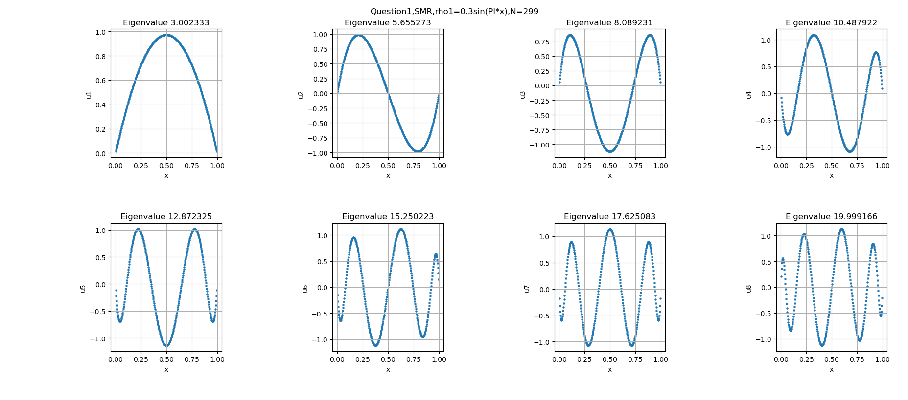


$\qquad$ 从上面的对比中我们可以看出，两种方法给出的解果还是有比较大的区别的，但是大体的形式都是一样的，不一样的是具体的值。