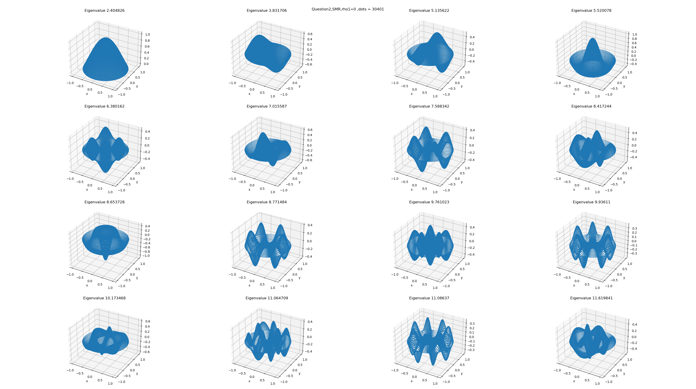
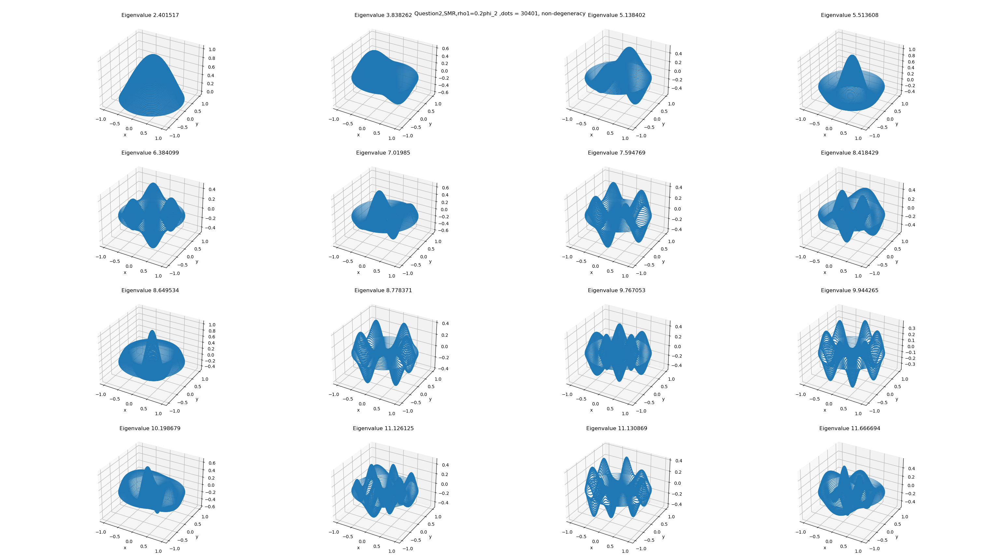

# 小课题 2

$$
\begin{align*}
& \frac{T}{\rho } \Delta u + \mu ^{2}u = 0 \\
& T = T_{0} = 1, \rho  = \rho _{0} + \rho _{1}, \rho _{0} = 1, u\vert _{\partial D} = 0 \\
\end{align*}
$$

$\qquad$ 在二维情况下，分别用有限差分法和谱方法讨论$\rho _{1} = 0\quad and\quad \rho _{1} = 0.2\varphi _{2}(\rho , \theta ) $情况下的本征值和本征向量并进行比较。

$\qquad$ 为了方便起见，我们另$\rho $ = 1。同时下面将给出前几个本征值和本征解(谱方法会用到，也可以用来检验有限差分法)：

|  | 1 | 2 | 3 | 4 | 5 | 6 | 7 | 8 |
|---|---|---|---|---|---|---|---|---|
| eigenvalue | 2.404826 | 3.831706 | 5.135622 | 5.520078 | 6.380162 | 7.015587 | 7.588342 | 8.417244 |
| solution | $J_{0}(x_{1}^{(0)}\rho )$ | $J_{1}(x_{1}^{(1)}\rho )(c_{1}cos(\theta )+d_{1}sin(\theta ))$ | $J_{2}(x_{1}^{(2)}\rho )(c_{2}cos(2\theta )+d_{2}sin(2\theta ))$ | $J_{0}(x_{2}^{(0)}\rho )$ | $J_{3}(x_{1}^{(3)}\rho )(c_{3}cos(3\theta )+d_{3}sin(3\theta ))$ | $J_{1}(x_{2}^{(1)}\rho )(c_{1}cos(\theta )+d_{1}sin(\theta ))$ | $J_{4}(x_{1}^{(4)}\rho )(c_{4}cos(4\theta )+d_{4}sin(4\theta ))$ | $J_{2}(x_{2}^{(2)}\rho )(c_{2}cos(2\theta )+d_{2}sin(2\theta ))$ |
|  | 9 | 10 | 11 | 12 | 13 | 14 | 15 | 16 |
| eigenvalue | 8.653728 | 8.771484 | 9.761023 | 9.936110 | 10.173468 | 11.064709 | 11.086370 | 11.619841 |
| solution | $J_{0}(x_{3}^{(0)}\rho )$ | $J_{5}(x_{1}^{(5)}\rho )(c_{5}cos(5\theta )+d_{5}sin(5\theta ))$ | $J_{3}(x_{2}^{(3)}\rho )(c_{3}cos(3\theta )+d_{3}sin(3\theta ))$ | $J_{6}(x_{1}^{(6)}\rho )(c_{6}cos(6\theta )+d_{6}sin(6\theta ))$ | $J_{1}(x_{3}^{(1)}\rho )(c_{1}cos(\theta )+d_{1}sin(\theta ))$ | $J_{4}(x_{2}^{(4)}\rho )(c_{4}cos(4\theta )+d_{4}sin(4\theta ))$ | $J_{7}(x_{1}^{(7)}\rho )(c_{7}cos(7\theta )+d_{7}sin(7\theta ))$ | $J_{2}(x_{3}^{(2)}\rho )(c_{2}cos(2\theta )+d_{2}sin(2\theta ))$ |

$\qquad$ 与一维情况不同的是，我们没有办法方便的对格点进行编号；需要采用特殊手段。这里只给出大致思路，具体实现见程序。

$\qquad$ 首先，我们对正方形区域划分格点，对内层格点进行赋值；然后判断某个格点是否在圆内，若是则不做变化；若否，则将该格点赋为0并判断其对上、下、左、右的格点是否有贡献，将贡献的部分去掉。最后，由于每个格点均与自身相关，因此我们可以通过判断矩阵对角元是否为零来寻找我们需要的矩阵元。如下图：

### 结果与讨论

#### a. 有限差分法($\rho _{1} = 0$)

| eigenvalues\Number of dots | 100 | 400 | 900 | 3600 | 6400 |
|---|---|---|---|---|---|
| 1 | 2.578268 | 2.464621 | 2.439114 | 2.422297 | 2.415229 |
| 2 | 4.062822 | 3.915696 | 3.881387 | 3.858329 | 3.847599 |
| 2 | 4.062822 | 3.915696 | 3.881387 | 3.858329 | 3.847599 |
| 3 | 5.323133 | 5.224450 | 5.186871 | 5.165878 | 5.152014 |
| 3 | 5.407789 | 5.232402 | 5.200259 | 5.172476 | 5.159448 |
| 4 | 5.739137 | 5.611964 | 5.578889 | 5.555316 | 5.541220 |
| 5 | 6.532333 | 6.464743 | 6.438781 | 6.418582 | 6.403287 |
| 5 | 6.532333 | 6.464743 | 6.438781 | 6.418582 | 6.403287 |
| 6 | 7.132890 | 7.088624 | 7.071272 | 7.055715 | 7.039858 |
| 6 | 7.132890 | 7.088624 | 7.071272 | 7.055715 | 7.039858 |
| 7 | 7.509506 | 7.579421 | 7.605549 | 7.623062 | 7.602930 |
| 7 | 7.703542 | 7.718550 | 7.674741 | 7.635971 | 7.623808 |
| 8 | 8.130765 | 8.422762 | 8.456727 | 8.455798 | 8.437989 |
| 8 | 8.469971 | 8.460922 | 8.457091 | 8.461917 | 8.447291 |
| 9 | 8.536715 | 8.670359 | 8.690188 | 8.695337 | 8.679237 |
| 10 | 8.576198 | 8.782688 | 8.805858 | 8.812967 | 8.796987 |

$\qquad$ **N的有效值要略小于上面给的** 上面我们给出了不同点的特征值以及当有6400个点时的本征解，我们可以看到本征值的收敛是十分缓慢的，同时也看到了$m \neq 0 $时会出现简并。

#### b. 有限差分法($\rho _{1} = 0.2\varphi _{2}(\rho , \theta )$)

| eigenvalues\Number of dots | 121 | 441 | 991 | 3721 | 6561 |
|---|:---:|:---:|:---:|:---:|:---:|
| 1 | 2.648596 | 2.538044 | 2.483049 | 2.450825 | 2.439435 |
| 2 | 4.175671 | 4.032419 | 3.951263 | 3.903539 | 3.885966 |
| 2 | 4.187751 | 4.044856 | 3.963551 | 3.915804 | 3.898107 |
| 3 | 5.453663 | 5.368236 | 5.282174 | 5.238037 | 5.211953 |
| 3 | 5.602957 | 5.422321 | 5.313338 | 5.242095 | 5.222733 |
| 4 | 5.908743 | 5.782628 | 5.681603 | 5.621983 | 5.597909 |
| 5 | 6.724336 | 6.667868 | 6.567885 | 6.506959 | 6.480064 |
| 5 | 6.733795 | 6.672076 | 6.569164 | 6.507527 | 6.480679 |
| 6 | 7.357569 | 7.304711 | 7.199232 | 7.136280 | 7.107985 |
| 6 | 7.367149 | 7.318218 | 7.213198 | 7.150832 | 7.122255 |
| 7 | 7.718942 | 7.823864 | 7.778118 | 7.722342 | 7.695658 |
| 7 | 7.968966 | 7.961798 | 7.810675 | 7.747427 | 7.714185 |
| 8 | 8.439380 | 8.652749 | 8.590401 | 8.562498 | 8.526706 |
| 8 | 8.677560 | 8.767453 | 8.656184 | 8.573844 | 8.547130 |
| 9 | 8.809652 | 8.945503 | 8.856006 | 8.801413 | 8.769820 |
| 10 | 8.827257 | 9.061956 | 8.984424 | 8.933198 | 8.901906 |

$\qquad$ 从本征值和本征态的对比中我们可以看出，相比于线性的，非线性的本征值有所增大；同时本征态也变得不规则。

#### c. 谱方法($\rho _{1} = 0$)

$\qquad$ 比较方便的是本征态中$\rho 、\theta $是分立的，这样我们就不需要进行繁琐的二重积分的运算，只需要将两个重积分的结果乘起来就好了。同时需要注意积分是在极坐标系下进行的，不能忘记了还需要乘度量因子。

$\qquad$ 同时，我们还需要想办法存储本征解，本次我们将用两个数组来存储参数的形式来表示本征解。为了方便起见，我们忽略简并并且只取cos函数部分，这对解的普适性没有影响，只是会相差一个角度。

$\qquad$ 这个结果其实没有什么参考意义，因为当$\rho _{1} = 0$时，谱方法给出的矩阵是对角阵，解就是标准解。

#### d. 谱方法($\rho _{1} = 0.2\varphi _{2}(\rho , \theta )$)

$\qquad$ 对于这个问题$f(\rho ,\theta ) = \frac{1}{1+0.2\varphi _{2}(\rho , \theta )} $，两个变量不是分开的，因此我们需要进行二重积分。

$\qquad$ 计算结果如下，我们得到的结论是本征值变小了；与FDM得到的结果相反，暂时我还没有想到是什么原因，计算原理应该没有问题，不然也得不到最后的结果。可能是某个系数什么的出了问题。

$\qquad$ 我想过有没有可能是没有考虑简并造成的，但结果并不是；考虑简并后，谱方法应该会得到一个和简并数同维的零子空间，如图：

$\qquad$ 由于谱方法没有考虑简并，所以画出来的图中本征态的模式会比FDM多，图不是一样的。