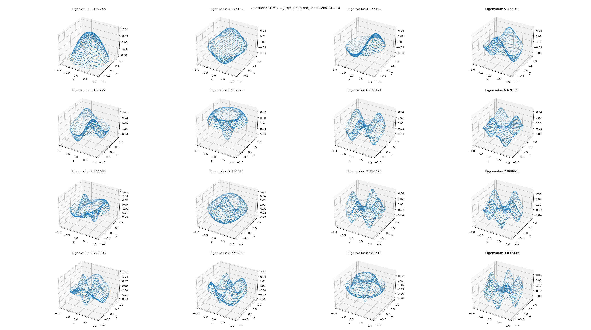
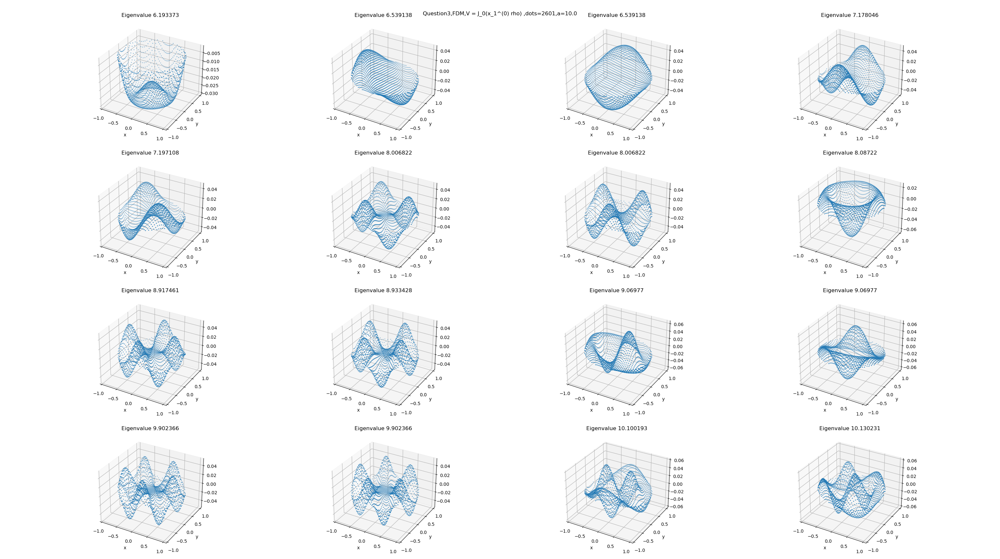
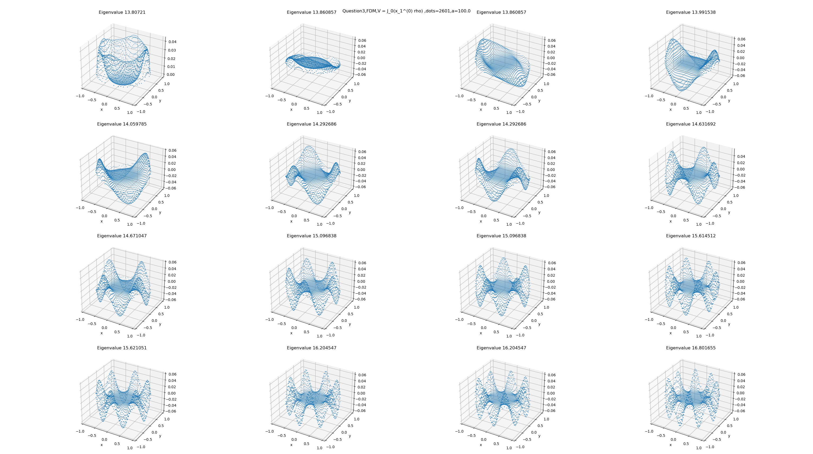
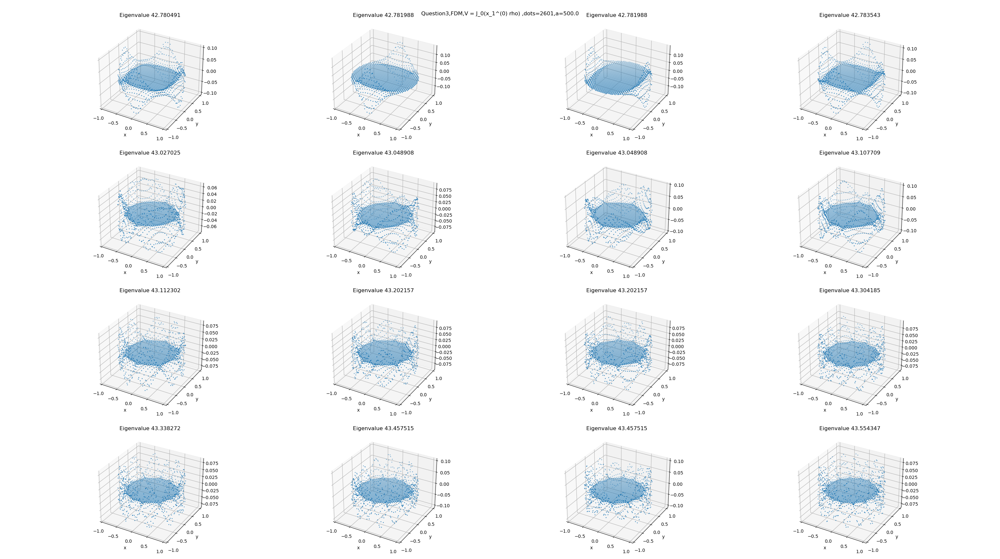
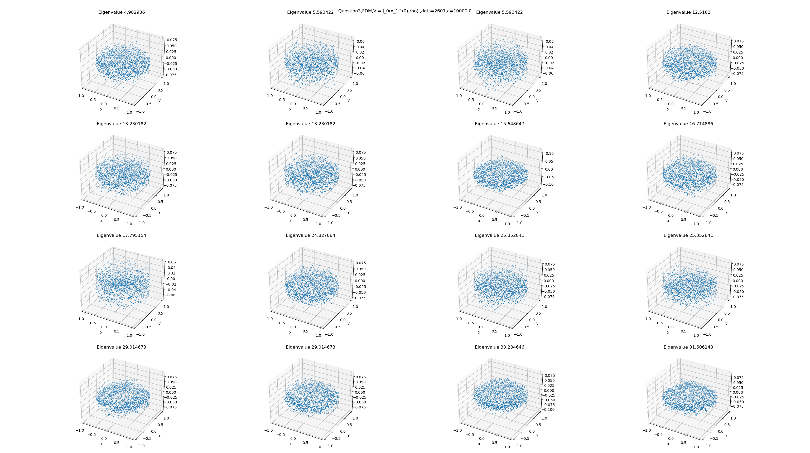

# 小课题 3

$\qquad$ 对于二维无穷深势阱，半径$\rho = 1 $；在圆内，$\hat{H} = \frac{\hat{p}^{2}}{2m} = -\frac{\hbar ^{2}}{2m}\Delta ,\psi \vert _{\partial D} = 0 $。取$\hbar = 2m = 1, E = \frac{\hbar ^{2}k^{2}}{2m} = k^{2} $。

$\qquad$ 1. 求解这一本征值问题：$\hat{H}\psi = E\psi $。写出本征值、本征态的表达式。
$\qquad$ 2. 按本征值从小到大排序，找基矢$\{E_{n}, \varphi _{n}(\rho ,\theta ), n=1,2,\dots \}$。
$\qquad$ 3. 增加势场，$V = a*\varphi _{1}(\rho ,\theta ), a = 1,10,100,\dots \hat{H} = -\frac{\hbar ^{2}}{2m}\Delta + V, \psi \vert _{\partial D} = 0 $，两种方法求解。a.谱方法、b.有限差分法。对比两种方法得到的本征值和本征态。

### 结果与讨论

#### a. 本征值问题求解

$\qquad$ 其实我们在通用理论中求过了，也就是二维圆形区域齐次Helmholtz方程的解(1st B.C.)，这里就直接改动一下就可以：

$$
\begin{align*}
& (\Delta + E)u(\rho , \theta) = 0,\quad \rho < 1;\theta \in [0,2\pi) \\
& u(1,\theta) = 0 \\
\end{align*}
$$

$\qquad$ 将上面的式子展开并考虑物理的情况：
$$
\begin{align*}
& \frac{1}{\rho}\frac{\partial }{\partial \rho}(\rho \frac{\partial u}{\partial \rho}) + \frac{1}{\rho ^{2}}\frac{\partial ^{2} u}{\partial \theta ^{2}} + Eu = 0 \\
& u(1,\theta ) = 0, u(\rho , \theta )\vert _{\rho = 0} 有限 \\
& u(\rho , \theta) = u(\rho , \theta+2\pi)
\end{align*}
$$

$\qquad$ 令$u(\rho , \theta) = R(\rho )\Phi (\theta) $，轴向方程为：

$$
\begin{align*}
& \frac{d^{2} \Phi(\theta )}{d\theta ^{2}} + m^{2}\Phi (\theta) = 0; \\
& \Phi (\theta ) = \Phi (\theta + 2\pi ) \\
\end{align*}
$$

$\qquad$ 在实数域中，其通解可以表示为：
$$\varphi (m) = \cos m\theta , \sin m\theta \quad m = 0, \pm 1, \pm 2, \dots $$

$\qquad$ 径向方程可以表示为：
$$
\begin{align*}
& \frac{1}{\rho }\frac{d }{d\rho }(\rho \frac{d R(\rho )}{d\rho }) + (E - \frac{m^{2}}{\rho ^{2}})R(\rho ) = 0\rightarrow Bessel Equation \\
& R(1) = 0, R(0)有限 \\
\end{align*}
$$

$\qquad$ Bessel方程的解为：
$$R^{(m)}(\rho ) = C_{m}J_{m}(k\rho ) + D_{m}N_{m}(k\rho) $$

$\qquad$ 将边界条件和物理条件代入可得：
$$
\begin{align*}
& R(0)有限\rightarrow D_{m} = 0 \\
& R(1) = 0\rightarrow J_{m}(\sqrt{E}) = 0 \\
\end{align*}
$$

$\qquad$ 因此，这个问题的本征值和本征解为：
$$
\begin{align*}
& E_{n}^{(m)} = [x_{n}^{(m)}]^{2},\quad n = 1,2,3,\dots \\
& R_{n}^{(m)}(\rho ) = J_{m}(x_{n}^{(m)}*\rho ),\quad n = 1,2,3,\dots \\
\end{align*}
$$

$\qquad$ 综上，这个本征值问题的解是：
$$
\begin{align*}
& E_{n}^{(m)} = [x_{n}^{(m)}]^{2},\quad n = 1,2,3,\dots \\
& \varphi _{n}^{(m)} = J_{m}(x_{n}^{(m)}*\rho )(c_{m}\cos{m\theta }+ d_{m}\sin{m\theta }), n = 1,2,3,\dots \quad and\quad m = 0,\pm1,\pm2,\dots
\end{align*}
$$

#### b. 本征值排序

|  | 1 | 2 | 3 | 4 | 5 | 6 | 7 | 8 |
|---|---|---|---|---|---|---|---|---|
| eigenvalue | 2.404826 | 3.831706 | 5.135622 | 5.520078 | 6.380162 | 7.015587 | 7.588342 | 8.417244 |
| solution | $J_{0}(x_{1}^{(0)}\rho )$ | $J_{1}(x_{1}^{(1)}\rho )(c_{1}cos(\theta )+d_{1}sin(\theta ))$ | $J_{2}(x_{1}^{(2)}\rho )(c_{2}cos(2\theta )+d_{2}sin(2\theta ))$ | $J_{0}(x_{2}^{(0)}\rho )$ | $J_{3}(x_{1}^{(3)}\rho )(c_{3}cos(3\theta )+d_{3}sin(3\theta ))$ | $J_{1}(x_{2}^{(1)}\rho )(c_{1}cos(\theta )+d_{1}sin(\theta ))$ | $J_{4}(x_{1}^{(4)}\rho )(c_{4}cos(4\theta )+d_{4}sin(4\theta ))$ | $J_{2}(x_{2}^{(2)}\rho )(c_{2}cos(2\theta )+d_{2}sin(2\theta ))$ |
|  | 9 | 10 | 11 | 12 | 13 | 14 | 15 | 16 |
| eigenvalue | 8.653728 | 8.771484 | 9.761023 | 9.936110 | 10.173468 | 11.064709 | 11.086370 | 11.619841 |
| solution | $J_{0}(x_{3}^{(0)}\rho )$ | $J_{5}(x_{1}^{(5)}\rho )(c_{5}cos(5\theta )+d_{5}sin(5\theta ))$ | $J_{3}(x_{2}^{(3)}\rho )(c_{3}cos(3\theta )+d_{3}sin(3\theta ))$ | $J_{6}(x_{1}^{(6)}\rho )(c_{6}cos(6\theta )+d_{6}sin(6\theta ))$ | $J_{1}(x_{3}^{(1)}\rho )(c_{1}cos(\theta )+d_{1}sin(\theta ))$ | $J_{4}(x_{2}^{(4)}\rho )(c_{4}cos(4\theta )+d_{4}sin(4\theta ))$ | $J_{7}(x_{1}^{(7)}\rho )(c_{7}cos(7\theta )+d_{7}sin(7\theta ))$ | $J_{2}(x_{3}^{(2)}\rho )(c_{2}cos(2\theta )+d_{2}sin(2\theta ))$ |

#### c. 外加势场

##### i. 有限差分法

| eigenvalues\a_value | 1.0 | 5.0 | 10.0 | 50.0 | 100.0 | 500.0 | 1000.0 | 10000.0 |
|---|---|---|---|---|---|---|---|---|
| 1 | 3.557318 | 6.152630 | 8.220676 | 16.946388 | 23.454414 | 42.780491 | 2.539764 | 4.982936 |
| 2 | 4.783757 | 7.204958 | 9.267214 | 18.019417 | 24.499542 | 42.781988 | 2.539764 | 5.593422 |
| 2 | 4.783757 | 7.204958 | 9.267214 | 18.019417 | 24.499542 | 42.781988 | 5.165888 | 5.593422 |
| 3 | 5.968467 | 8.215032 | 10.249392 | 19.038088 | 25.498546 | 42.783543 | 7.912208 | 12.516200 |
| 3 | 5.980002 | 8.220318 | 10.252384 | 19.042069 | 25.504263 | 43.027025 | 9.125436 | 13.230182 |
| 4 | 6.265163 | 8.330654 | 10.302893 | 19.060476 | 25.518547 | 43.048908 | 10.870765 | 13.230182 |
| 5 | 7.143048 | 9.217510 | 11.198813 | 20.015305 | 26.463612 | 43.048908 | 10.870765 | 15.648647 |
| 5 | 7.143048 | 9.217510 | 11.198813 | 20.015305 | 26.463612 | 43.107709 | 12.873106 | 16.714886 |
| 6 | 7.669447 | 9.474167 | 11.324126 | 20.054123 | 26.497654 | 43.112302 | 12.873106 | 17.795154 |
| 6 | 7.669447 | 9.474167 | 11.324126 | 20.054123 | 26.497654 | 43.202157 | 14.748771 | 24.827884 |
| 7 | 8.290320 | 10.212483 | 12.127426 | 20.950997 | 27.390415 | 43.202157 | 15.844984 | 25.352841 |
| 7 | 8.301722 | 10.218844 | 12.130568 | 20.951625 | 27.391893 | 43.304185 | 15.873135 | 25.352841 |
| 8 | 9.003120 | 10.616945 | 12.343162 | 20.999822 | 27.430134 | 43.338272 | 16.606030 | 29.014673 |
| 8 | 9.031075 | 10.637205 | 12.357474 | 21.011485 | 27.446922 | 43.457515 | 17.839473 | 29.014673 |
| 9 | 9.229281 | 10.761134 | 12.428691 | 21.024268 | 27.455525 | 43.457515 | 17.839473 | 30.204646 |
| 10 | 9.435608 | 11.215809 | 13.052124 | 21.852274 | 28.286195 | 43.554347 | 18.627767 | 31.606148 |

$\qquad$ 区分不同的图请看标题，上面的a都有对应的图，这里只给出对比性比较强的几个：

$\qquad$ 我们可以看到，在a<100的时候，本征值是随a增加而增加的；当a达到一定程度的时候，也就是V起主导作用时，中心的势场较大，本征态对应的值就比较小。当V趋向于无穷时，出现问题了；这种解我感觉不应该在物理上存在，应该是有限差分法的bug。当然这只是猜测。暂时还没法验证。

##### ii.谱方法

$\qquad$ 这里的公式和通用理论给出的结果不太一样，但是原理是一样的；因此我们直接给出结论：

$$M_{mn}*\widetilde{k_{n}^{2}} \rightarrow M^{\prime}_{mn} = \left\langle \varphi _{m}, (\widetilde{k_{n}^{2}}+V(x))\varphi _{n}(x) \right\rangle $$

$\qquad$ 对于本题，V不含$\theta $项，因此不需要使用重积分。